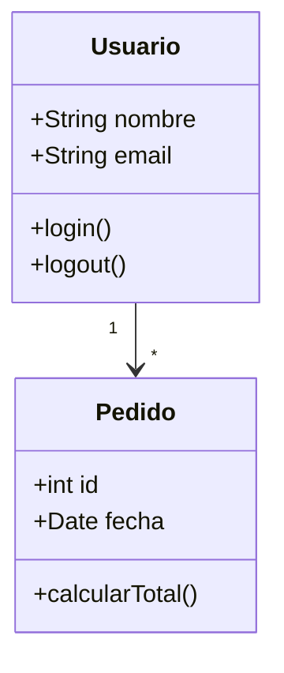

```mermaid
classDiagram

    class Usuario {
        +String nombre
        +String email
        +login()
        +logout()
    }

    class Pedido {
        +int id
        +Date fecha
        +calcularTotal()
    }

    Usuario "1" --> "*" Pedido
```
